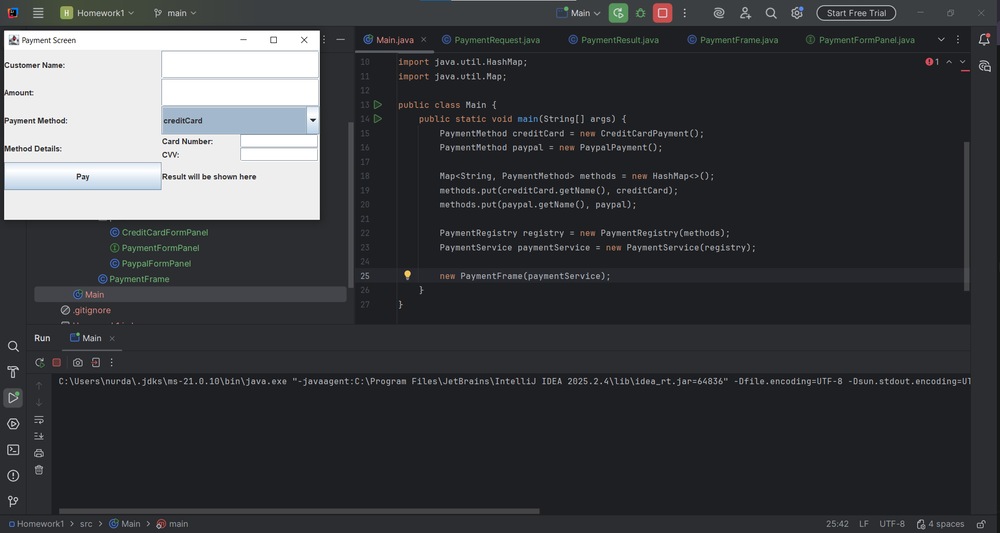
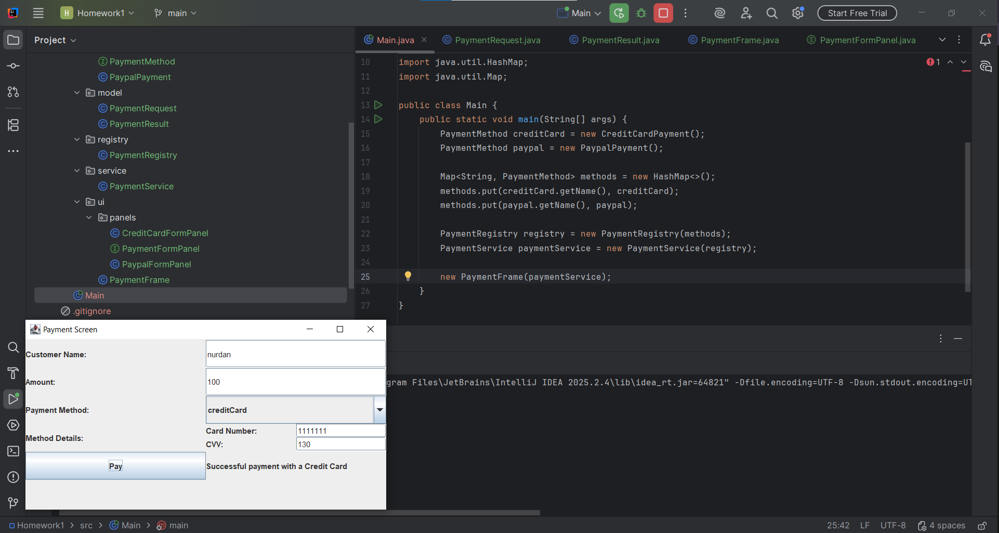
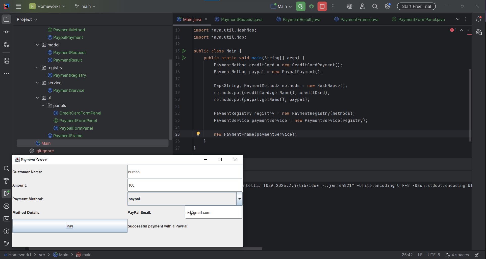

# Payment System - New Payment Method Integration

## Assignment Description
This project was developed for the assignment **“New Payment Method Integration (with SOLID Principles)”**.

In this scenario, an existing payment screen already includes some payment methods.  
The goal is to integrate a **new payment method** into the system while preserving the existing structure as much as possible.

## Expectations
- Extend the system without breaking the current code structure
- Apply **SOLID** principles during integration
- Focus especially on:
    - **OCP (Open/Closed Principle):** extend the system without modifying core logic
    - **SRP (Single Responsibility Principle):** each class should have one responsibility
- Keep the structure open for future payment methods

## Technical Scope
The application includes a basic payment flow with:
- **Existing payment method:** Credit Card
- **New payment method:** PayPal

## Design Approach
- `PaymentMethod` defines the common contract
- `CreditCardPayment` and `PaypalPayment` implement this contract
- `PaymentRegistry` stores available payment methods
- `PaymentService` manages the payment flow
- `PaymentFrame` provides a simple Swing-based UI

## Why PaymentRegistry?
`PaymentService` depends on `PaymentRegistry` instead of a single `PaymentMethod`, so the service can work with multiple payment methods dynamically. This makes the system more extensible and better aligned with OCP.

## Application Screenshots

### Payment Options

### Credit Card Payment

### PayPal Payment

## How to Run
Run `Main.java` in IntelliJ IDEA.